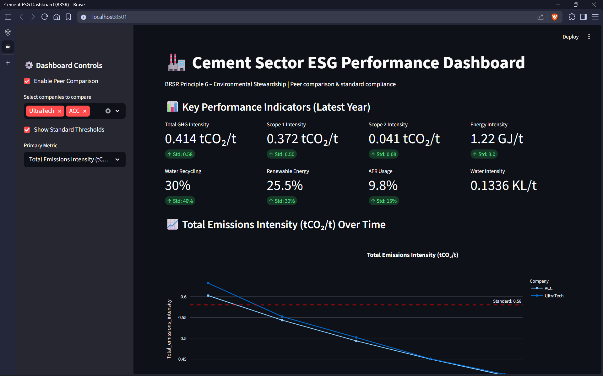
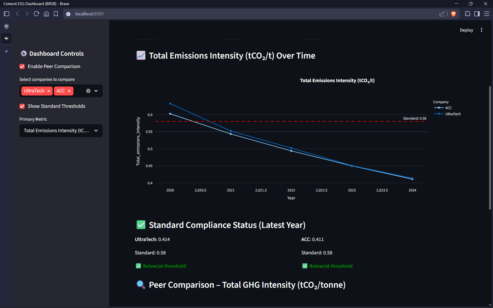
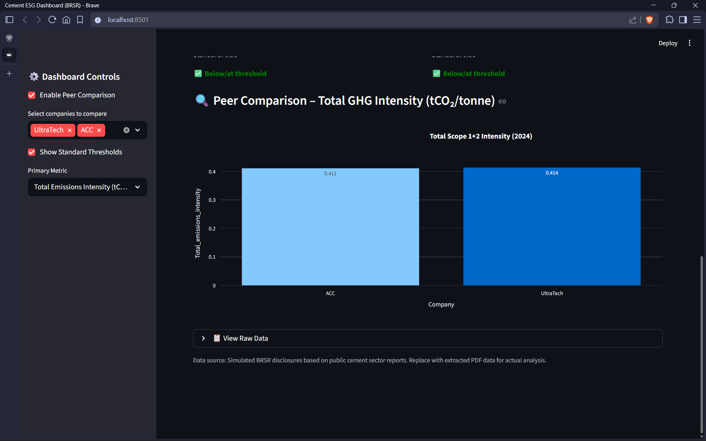

# 🏭 ESG Performance Dashboard (BRSR)

An interactive **Streamlit** dashboard for analyzing and benchmarking Environmental, Social, and Governance (**ESG**) performance data from cement companies using the **Business Responsibility and Sustainability Reporting (BRSR)** framework.

This project demonstrates ESG data ingestion, KPI calculation, sustainability analytics, compliance benchmarking, and interactive reporting tailored to the cement industry.


---

## 🚀 Live Demo

**Streamlit App:** *[Add your Streamlit Cloud deployment URL here](https://esg-brsr-dashboard.streamlit.app/)*

---

## 📋 Features

### 🌍 ESG Performance Monitoring

* Calculate and visualize **Total GHG Emissions Intensity** (Scope 1 + Scope 2).
* Track emissions per tonne of cementitious product.
* Align metrics with BRSR reporting requirements and GHG Protocol principles.
* Monitor environmental performance across multiple reporting years.

### ✅ Compliance Benchmarking

* Toggle industry-standard threshold values.
* Compare company performance against sector benchmarks.
* Visual compliance indicators and status badges.
* Quickly identify areas requiring improvement.

### 🏢 Peer Comparison

* Compare multiple cement manufacturers side-by-side.
* Benchmark companies such as UltraTech and ACC.
* Analyze relative ESG performance across key sustainability metrics.

### 📈 Trend Analysis

Interactive visualizations for:

* Greenhouse gas emissions
* Energy consumption
* Renewable energy usage
* Water consumption
* Alternative Fuel & Raw Material (AFR) usage
* Waste generation and recycling metrics

### 📊 KPI Scorecards

* Executive-level ESG dashboard view.
* Instant access to key sustainability indicators.
* Latest reporting-year performance metrics.
* Intensity-based and absolute performance measures.

### 🔍 Data Transparency

* Expandable raw data tables.
* Transparent metric calculations.
* Easy audit and validation support.

---

## 📸 Dashboard Preview

### Dashboard Overview



*Executive KPI view showing GHG intensity, energy intensity, renewable energy usage, water metrics, and overall ESG performance indicators.*

---

### Emissions Trend Analysis



*Multi-year emissions intensity tracking with industry benchmark thresholds for performance monitoring and compliance assessment.*

---

### Peer Comparison



*Compare ESG performance across multiple cement manufacturers and benchmark against sector standards.*

---

## 🛠 Tech Stack

| Component       | Technology                           |
| --------------- | ------------------------------------ |
| Dashboard       | Streamlit                            |
| Data Processing | Pandas, NumPy                        |
| Visualization   | Plotly Express, Plotly Graph Objects |
| Data Storage    | CSV                                  |
| PDF Extraction  | pdfplumber                           |
| Language        | Python                               |

---

## ⚙️ Installation

### 1. Clone the Repository

```bash
git clone https://github.com/jv0019/esg-brsr-dashboard.git
cd esg-brsr-dashboard
```

### 2. Create a Virtual Environment (Optional)

```bash
python -m venv venv
```

Activate the environment:

**Windows**

```bash
venv\Scripts\activate
```

**Linux / macOS**

```bash
source venv/bin/activate
```

### 3. Install Dependencies

```bash
pip install -r requirements.txt
```

### 4. Launch the Dashboard

```bash
streamlit run app.py
```

The application will be available at:

```text
http://localhost:8501
```

---

## 📂 Project Structure

```text
esg-brsr-dashboard/
│
├── screenshots/
│   ├── dashboard-overview.png
│   ├── trend-analysis.png
│   └── peer-comparison.png
│
├── data/
│   └── cement_brsr_sample.csv
│
├── app.py
├── extract_brsr.py
├── requirements.txt
└── README.md
```

### File Descriptions

| File                     | Purpose                                  |
| ------------------------ | ---------------------------------------- |
| `app.py`                 | Main Streamlit dashboard application     |
| `extract_brsr.py`        | Extract ESG tables from BRSR PDF reports |
| `cement_brsr_sample.csv` | Sample ESG dataset                       |
| `requirements.txt`       | Project dependencies                     |
| `README.md`              | Project documentation                    |

---

## 📊 Data Source

The project currently uses a sample dataset located at:

```text
data/cement_brsr_sample.csv
```

The dataset contains realistic ESG performance figures inspired by publicly available sustainability disclosures from leading Indian cement manufacturers.

### Using Real BRSR Data

1. Download annual reports or BRSR reports.
2. Extract sustainability tables using:

```bash
python extract_brsr.py
```

3. Clean and validate the extracted data.
4. Replace or append records in:

```text
data/cement_brsr_sample.csv
```

5. Restart the Streamlit application.

---

## 💡 Why This Project?

This project demonstrates practical ESG analytics skills applicable to sustainability consulting, ESG reporting, climate-tech, manufacturing, and industrial decarbonization.

### Sustainability & ESG Expertise

* BRSR Framework reporting
* ESG KPI development
* Environmental performance analysis
* Cement-sector decarbonization metrics
* Principle 6 environmental stewardship reporting

### Data Engineering

* PDF table extraction
* Data cleaning and normalization
* Structured ESG dataset creation
* KPI calculation pipelines

### Data Analytics & Visualization

* Interactive dashboards
* Benchmarking systems
* KPI scorecards
* Trend analysis and reporting

### Industry Applicability

Useful for:

* ESG Analysts
* Sustainability Consultants
* Corporate Sustainability Teams
* Auditors and Assurance Providers
* Environmental Reporting Teams
* Manufacturing & Industrial Organizations

---

## 🛣 Roadmap

### Near-Term Enhancements

* [ ] Automated BRSR PDF ingestion
* [ ] Advanced ESG benchmarking engine
* [ ] Data validation workflows
* [ ] Improved company comparison views
* [ ] Additional KPI visualizations

### Future Enhancements

* [ ] Scope 3 emissions modeling
* [ ] Transportation emissions analysis
* [ ] Raw material emissions estimation
* [ ] CPCB/SPCB compliance tracking
* [ ] Sustainability report PDF generation
* [ ] Excel and PowerPoint exports
* [ ] Live ESG data integration
* [ ] Carbon reduction scenario modeling

---

## 🤝 Contributing

Contributions are welcome.

1. Fork the repository.
2. Create a feature branch.
3. Commit your changes.
4. Submit a pull request.

---

## 📜 License

This project is licensed under the **MIT License**.

You are free to use, modify, and distribute this project for educational or commercial purposes.

---

## 👤 Author

**Jivitesh Sachdev**

Engineering • ESG Analytics • Sustainability Data • Python Development

GitHub: https://github.com/jv0019

---

### Keywords

ESG • Sustainability Analytics • BRSR • Streamlit • Plotly • Python • Carbon Accounting • Environmental Reporting • Cement Industry • Climate Tech • Sustainability Consulting
